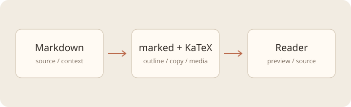

# 从终端到阅读空间

> LoganTerminal · 阅读器验收样例

## 模型与目标

这份报告用于检查**中文排版**、数学公式、代码与图片在同一阅读列中的呈现。文档可以独立打开，也可以放在正在运行的终端旁；两个视图保留各自的阅读位置。

考虑带约束的最小二乘模型，决策变量为 $x_i$：

$$
\min_{x \ge 0}\quad \frac{1}{2}\|Ax-b\|_2^2 + \lambda \sum_{i=1}^{n}|x_i|
$$

### 矩阵与计算

$$
A=\begin{pmatrix}1&2&3\\4&5&6\\7&8&9\end{pmatrix},\qquad
\nabla f(x)=A^{\mathsf T}(Ax-b)
$$

$$
\begin{aligned}
f(x)&=\sum_{t=1}^{T}(y_t-\hat y_t)^2\\
\lim_{h\to 0}\frac{f(x+h)-f(x)}h&=f'(x)
\end{aligned}
$$

## 结果

| 场景 | 参数 λ | 误差 | 解释 |
|---|---:|---:|---|
| 基准 | 0 | 0.032 | 无正则化 |
| 稀疏 | 0.1 | 0.038 | 保留主要特征 |
| 稳健 | 0.5 | 0.051 | 更强的约束 |

以下代码应保留变量名与缩进，复制后包含原文末尾换行：

```sh
printf '%s\n' "$PATH"
for i in 1 2 3; do
  echo "iteration $i"
done
```



## 结果

重复标题也应拥有独立的目录入口。图片的解析依据报告目录，与后台 shell 后续切换的目录无关。

- [项目主页](https://github.com/Kuddev/pebrel)
- 本文只读；修改和保存继续使用文件审阅。

### 错误资源仍应可读


$$\unsupportedcommand{x}$$

<script>alert('HTML 应作为文字显示')</script>
