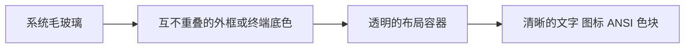

## Context

本变更实现 proposal.md 中的三项能力：原生窗口材质、统一背景合成与外观设置。当前项目是 Tauri 2 + React 19 + xterm 6；Cargo.lock 锁定 Tauri 2.11.3。标题栏和侧栏使用 Tailwind 的半透明色及 backdrop blur，但 body、root、主工作区、terminal-surface 和 xterm 默认背景均为不透明底色。

现有主题通过 themes.ts 同时提供 CSS token 与 ANSI palette；settingsStore 在首次渲染前应用 localStorage 设置。Terminal 在创建时加载 WebGL，设置订阅仅修改现有实例。文档工作区依赖固定挂载位置和稳定的 terminalTabId/paneId，重建 Terminal 会丢失输出历史，清理还会杀死 PTY。

Pebrel 的参考版本为 `9dd3d6491bfaaf902a4a3a248c02f36a47abae2d`。参考点包括系统材质与背景 alpha 分离、文字不透明，以及避免背景重复合成；其 GPUI、Windows DesktopAcrylicController 和保留但已停用的噪点覆盖代码不作为本项目实现。

参考依据：

- [Pebrel 材质与透明度](https://github.com/Kuddev/pebrel/blob/9dd3d6491bfaaf902a4a3a248c02f36a47abae2d/nebula_app/src/gpui_shell/wallpaper.rs)
- [Pebrel 面板合成](https://github.com/Kuddev/pebrel/blob/9dd3d6491bfaaf902a4a3a248c02f36a47abae2d/nebula_app/src/gpui_shell/theme.rs#L303-L346)
- [Tauri 窗口材质配置](https://v2.tauri.app/reference/config/#windoweffects)、[xterm 透明初始化约束](https://xtermjs.org/docs/api/terminal/interfaces/iterminaloptions/#allowtransparency)
- 当前本机依赖源码：Tauri 2.11.3 的 vibrancy/macos.rs、vibrancy/windows.rs，以及 window-vibrancy 0.6.0。Tauri 的材质包装层未传播底层 apply/clear 错误，因此仅根据 set_effects 返回值不能可靠判断应用结果。

## Goals / Non-Goals

**Goals:**

- 提供可切换、可持久化的 macOS Vibrancy / Windows Acrylic 玻璃外观。
- 用同一个不透明度控制外框及终端默认背景，保持文字、图标和显式 ANSI 背景清晰。
- 支持主题、透明度和材质实时切换，保持全部终端、PTY、选区及工作区状态。
- 原生材质不可用时确定地显示实色，并提供简短、可理解的反馈。
- 保持文档阅读、设置和命令弹窗的可读性，兼容现有实色主题与装饰设置。

**Non-Goals:**

- GPUI 迁移、复制 Pebrel 源码、Windows App Runtime/自定义 DesktopAcrylicController。
- Mica 材质选择器、任意背景图片、噪点渲染、模糊半径滑块或动态壁纸。
- Agent Hook、回答捕获、补全、SSH/SFTP、后台会话保活。
- 修改已完成的文档工作区 change、重构 PTY 或改变工作区焦点路由。

## Decisions

### D1: 由 Rust 适配模块管理原生材质

新增独立 window_appearance 模块，暴露针对主窗口的 apply_window_appearance 命令。请求包含 mode（solid/glass）和 blur（缺省视为开启）；glass 且 blur 关闭时不使用原生材质——清除已有原生层，返回 effectiveMode=glass、material=none，前端着色仍然生效，窗口纯透明。返回 requestedMode、effectiveMode、material（none/vibrancy/acrylic）及状态、简短原因。无效 mode 返回参数错误，保留既有有效状态。

macOS 平台依赖直接声明与当前 Tauri 兼容的 window-vibrancy 0.6；Windows 使用 windows-sys 0.59 与 windows-version 0.1，由一个适配层负责应用和清理，避免同时配置静态 windowEffects 和调用第二套运行时材质。原因是锁定版本的 Tauri 包装层丢弃底层错误；macOS 直接调用可得到应用/清理结果。Windows 的 window-vibrancy 0.6 也丢弃了底层 HRESULT/BOOL，改为独立小适配：Windows 11 22H2+ 检查 DwmSetWindowAttribute 返回值，Windows 10 1809+/早期 Windows 11 动态解析 SetWindowCompositionAttribute 并检查 BOOL，缺失 API 或失败码均传回前端。后续若 Tauri 提供完整错误传播，可在保持命令契约的前提下替换适配层。

macOS 首选 NSVisualEffectMaterial::UnderWindowBackground，使用 BehindWindow 的系统模糊；保留系统对窗口激活和透明效果的处理。Windows 首选 Acrylic，不自动替换成视觉语义不同的 Mica。Linux 和普通浏览器预览使用实色回退。原生效果只在模式切换或初始化时应用，不跟随透明度滑块、终端输出或普通重新渲染。

所有原生操作在主线程执行。同一已生效状态的重复请求为幂等操作（glass+blur、glass 无 blur、solid 三态各自幂等）；切回 solid 或在 glass 下关闭模糊都会清理旧材质，切换及恢复重试不能堆叠 NSVisualEffectView 或 Windows 效果。底层应用失败时返回 effectiveMode=solid，前端立即覆盖不透明底色；清理失败也返回可读状态，实色覆盖保证界面仍可用。

“已应用”只表示原生 API 调用成功，不证明系统在所有透明度、焦点或辅助功能策略下均绘制可见模糊；真实效果通过桌面验收确认。

### D2: 窗口具备透明能力，实色由前端背景覆盖

macOS/Windows 窗口在创建时具备透明背景能力，以支持运行时切换而不重建窗口；Linux 保持普通窗口。沿用现有装饰、Overlay 标题栏、交通灯位置和拖动区域。按当前锁定版本配置 transparent 及 macOS 所需的 macOSPrivateApi，使用平台配置文件隔离差异；不为 Linux 启用这些选项。

实施第一步以当前锁定依赖核验 WKWebView 透明链、native view 的位置和 Windows 窗口阴影。配置需求依赖版本，以本项目构建及运行结果为准，不根据在线最新文档假定旧 SDK 已具备同样路径。

前端启动时有效外观先为 solid；读取设置、获得原生结果后再切换到 glass。原生调用失败或超时（3 秒）时维持 solid，窗口不能因初始化失败长期隐藏。后续手动选择玻璃可重试。

### D3: 区分用户偏好与当前生效状态

settingsStore 持久化 windowMaterial（solid/glass）、backgroundOpacity（0.10–1.00）和 backgroundBlur（默认开启）。缺失或非法材质回退 solid；缺失、非法或非有限不透明度回退 0.75，有限越界值钳制；缺失模糊回退开启。存储键为 logan.windowMaterial、logan.backgroundOpacity、logan.backgroundBlur，使用前端小数值，UI 展示整数百分比。

首次和升级时缺少新键均保持现有实色外观；用户选择玻璃后持久化。solid 模式背景一律不透明，但记住玻璃不透明度，回到 glass 时恢复。100% 允许作为玻璃模式的上限，底色会遮住系统材质，属于正确行为。

运行时 effectiveMode、material 和失败状态单独保存，不写入偏好。不支持平台保留 glass 偏好及简短说明，但有效 token 使用 solid。清理失败在 solid/glass 两种偏好下均显示可读状态并支持重选当前材质重试。材质按钮暴露 aria-pressed，模糊开关暴露 switch/aria-checked，状态变化由 polite live region 宣告。设置面板只展示用户能理解的状态，不展示 HWND、API 名或异常堆栈。

材质切换经单一协调器串行执行，原生状态检查与更新在同一 UI 线程操作内完成，命令运行于 Tauri async 线程池；UI 在请求完成前保留上一生效外观，后续请求覆盖待执行目标。前端用 revision 忽略过时结果，超时后收到旧结果仍不得改变 token，并将最新目标重新协调到原生状态，避免前后端不一致。3 秒计时器只结束 UI 等待，不取消或丢失真实 IPC promise；旧调用结束前不发送新的原生操作。迟到结果不直接改变 token，协调最新目标；若目标未变，最多自动重放一次，连续超时保持实色并允许手动重试，避免无限循环。组件卸载后取消订阅，协调器不依赖 SettingsPanel 挂载。

### D4: 每个可见区域只绘制一次基础底色

新增 surface policy，将主题、effectiveMode 和 backgroundOpacity 推导成独立 token，例如 --surface-shell、--surface-terminal、--surface-modal、--surface-reader。原有主题颜色和 ANSI palette 保持作为颜色来源，不将通用 --color-panel 改成带 alpha 的颜色以免全局阅读和弹窗一并透明。

body、root、App 和 workspace-main 在玻璃生效时保持透明，不铺全窗口半透明 tint 再给子区域铺第二层。AppHeader、Sidebar、标签导航及外框缝隙在自己的区域绘制 shell 色；workspace-frame 使用裁剪的外扩阴影只填充工作区内容盒外侧（含边框及圆角空隙），侧栏 resize handle 自己绘制 shell 色；各终端 pane 在自己的区域绘制 terminal 色。实际挂载位置和圆角裁剪先核验，再明确 root 网格的独立装饰层，避免父子实色背景叠加。

玻璃模式的 shell 和 terminal 基础 alpha 均为用户不透明度；边框、hover、选区作为局部反馈单独合成。solid 模式保持现有主题底色。不对包含内容的 DOM 容器设置整体 opacity，不对终端文字应用 blur/filter。细边框、约 10px 面板圆角与轻阴影使用统一 token，避免每个窗格重复大面积 backdrop blur。

替代方案是对整个 App 设置 opacity，或仅增加 CSS backdrop-filter；前者损害文字清晰度，后者不能模糊 WebView 外的桌面。

### D5: xterm 在首次创建时具备透明能力

所有 Terminal 在首次 open 前设置 allowTransparency=true，后续只更新 term.options.theme，不通过切换 React key、重新 open、dispose 或创建 PTY 实现外观切换。默认背景由 pane surface 绘制一次，xterm 的默认背景透明，ANSI 显式背景、光标、选区和文字继续使用原有 palette。solid 时 pane 提供完整底色；原生失败时相同规则回退不透明 pane。

设置订阅需包含有效材质、不透明度以及主题/accent 变化；后台隐藏 pane 同步更新，恢复显示时执行已有 fit 流程，不新建终端。WebGL 正常路径和上下文丢失后的现有渲染回退均需验收。

这会让实色模式的 xterm 也启用透明能力，是保留实例和实时切换的代价。用相同输入的实色/玻璃运行记录验证滚动和调整分屏表现，不承诺尚未测量的零性能影响。

### D6: 装饰与阅读外观分层

玻璃模式将网格强度降至当前值的约四分之一，漂浮光球 alpha 降至当前值的约三分之一，避免与桌面背景竞争。ambientMotion、crtMode 和动画速度的存储值不被材质切换改写；关闭 ambient、系统 reduced-motion 及原有 CRT 行为继续成立，切回实色恢复原来的视觉强度。

阅读器的正文、目录、代码、公式继续使用 readerAppearance 对应的不透明底色，包含 follow-theme；全局玻璃只用于适用的工作区外框。设置、命令面板、搜索、Agent 总览、worktree 等交互弹窗使用至少 92% 不透明背景；图片 lightbox 和遮罩保留既有用途。禁止把 reader surface 引用改成全局透明 panel token。

### D7: 验证以真实窗口和生命周期为主

规格通过后，仅给非平凡逻辑补针对性测试：偏好归一化、surface policy、串行协调/过时响应，以及外观更新不触发 terminal dispose/PTY kill 的回归。CSS 数值和静态类名不写镜像测试。

macOS 必须在有纹理的桌面和另一个移动窗口前验收 Vibrancy，记录实色、75%、40%、20%、10%、模糊开关两档、浅/深主题及失焦效果。Windows 在真实 Windows 上验收 Acrylic、拖动/resize、关闭材质和错误回退；若实施环境暂不可用，在 validation.md 标为未验证，相关验收任务保持未完成。浏览器截图仅用于前端布局。

## Risks / Trade-offs

- 透明层合成使玻璃变厚或出现黑/白底 → 使用单次底色模型，核验 WebView、xterm viewport、canvas 及 rounded clipping 全链，100% 与低 alpha 同时对照。
- Tauri 版本及平台原生行为不同 → 先完成平台接通验证，用 direct window-vibrancy 结果而非 Tauri 包装层成功值判断应用失败，保持不透明回退。
- 异步材质切换产生过时状态 → 原生串行操作、前端 revision 和最新目标重放，超时保持可用实色。
- 透明 xterm 的渲染成本增加 → 保留单个系统模糊层、不为每 pane 添加 backdrop-filter，检查多分屏滚动及 WebGL 回退。
- 系统策略或失焦导致原生效果减弱 → 尊重系统行为，保留文字与实色选择；状态说明区分 API 应用和视觉验收。
- 当前工作区有文档阅读实现的未提交改动 → 以当前文件为基线，只实施该 change 的目标差异，不重置、归档或一并提交其他工作。

## Migration Plan

1. 核验锁定 SDK 的平台透明和材质路径，完成可回退适配层。
2. 加入独立偏好和有效外观协调器，缺失新键保持实色，不修改旧主题及装饰键。
3. 统一 surface token，接通 xterm 和外观设置，保持当前工作区组件身份。
4. 完成针对性逻辑测试、现有前后端检查及平台视觉/生命周期验收，记录证据。
5. 回滚外观时用户选择 solid 即恢复实色；版本回滚时旧版本忽略新增键，旧主题、reader 设置和工作区快照保持可读。

## Open Questions

没有需要用户决定才能实施的范围问题。平台材质的最终视觉强度及当前 SDK 的透明背景接通细节通过首项技术验证和后续实机验收确定；Windows 验收依赖可用 Windows 环境，不以编译通过替代视觉证据。
